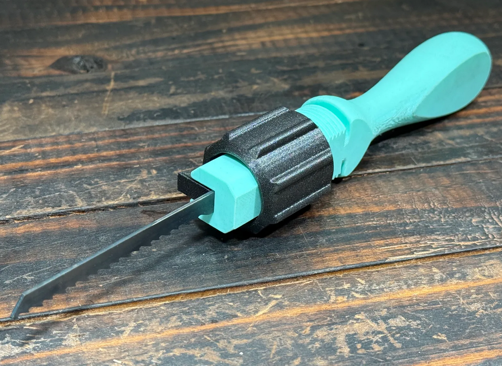
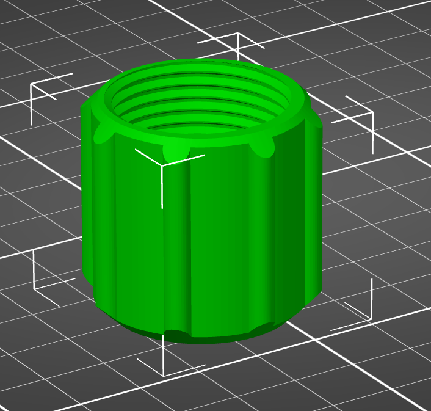
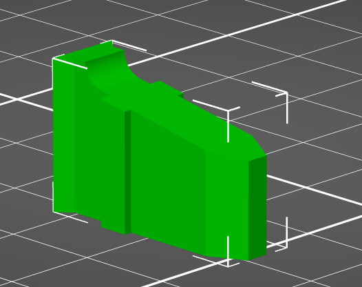
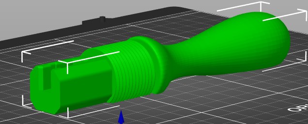
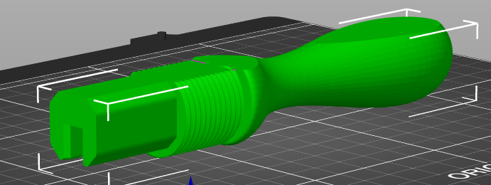

### ENGR 102: Final Exam Practice

This exercise is intended to provide an opportunity for you to articulate many of the skills from this course in a single activity. We will explore how this particular object from printables (contributed by [this gentleman](https://www.printables.com/@PabloUntroib_974957)) can be evaluated from an engineering design perspective, considered from the perspective of 3D printed manufacturing, and finally provide a vehicle for describing how you would approach the design of the components in Fusion 360.

### The Object: A handle for jigsaw blades

For those who have not used a jigsaw is it commonly a reciprocating power tool these days. The power tool pushes the blade forward and back in the vertical plane. It cuts, as you can see from the teeth, on the upstroke. The blades for this tool are easily available and there some applications where using it by hand would be more effective that using the power tool. This object addresses this need.

**Deliverable(s): 1** 

**Engineering Observation:** What details do you notice about the design of this tool? How many distinct parts appear to be involved? Can you decide which way the nut moves to hold the blade in place? Can you articulate a reason why one side is flat?

### The Nut:

**Deliverable(s): 2** 

**3D Printing:** Assuming you are printing this object with a 3D filament printer is there a better orientation on the build plate - why or why not? Are there features which will probably need supports in this orientation? Would you print this part with thick layers (0.30 mm or greater) or with thin layers (0.15 or 0.20 mm)? Explain your reasoning.

**Deliverable(s): 3** 

**Fusion 360:** When you are designing this component what are the first sketches you will extrude? On what plane will you make the sketch for the ribs of the nut? Why would it be a bad idea to do it on your first sketch? What tool is used to create the 'cut back' on the top and bottom of the nut?

**Deliverable(s): 4** 

Assuming you extruded the entire shape upwards as your first step in Fusion describe how you would go about creating the angled top surface of the lock wedge?

**Deliverable(s): 5** 

**Engineering Design: Manufacturing** Why did the designer create a flat side on the entire handle? Given the use of the tool does this seem like the correct side to make flat from the users perspective?

**Deliverable(s): 6** 

**3D Printing:** How would you test this design to see if it fits the jigsaw blades you have access to? How would you test this design to see if the threads on the nut and the handle match well? In what order would you print these three parts as you are exploring how the parts fit together? Explain your reasoning. If the lock wedge is too tight to fit in the slot which part would you choose to scale to get the parts to fit? Explain your reasoning.

**Deliverable(s): 7** 

**Fusion 360:** When creating a Fusion model of the handle which parts of the handle would you create by revolving and which parts by extruding? Describe at least 4 sketches that you would do, and on which plane, to create a model of this handle. Identify at least 3 edges where the fillet tool was used in this design -- make a clear sketch