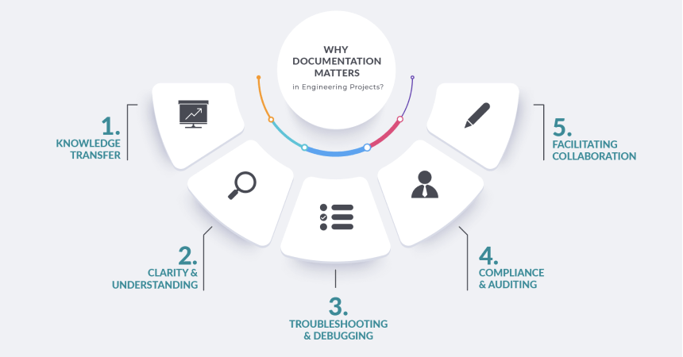
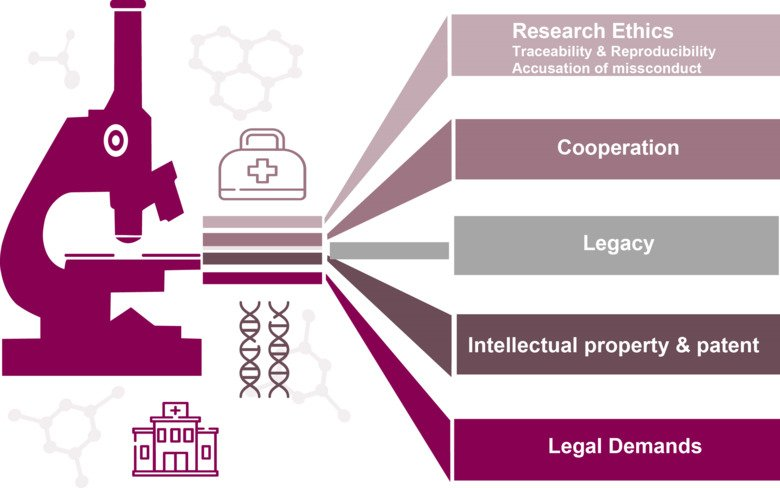

## Week 2 Content

General plan is engineering documentation, extrusions for Fusion, and generating gcode from .stl files for lab.

### Day 1 (Monday)

### Engineering Process and Documentation

* Review from previous week: questions, clarifications, etc. COCC admin issues?

* Articulate the general plan from above.

* Specific Fusion questions/issues from week 1 assignments (we will validate sketching skills this week)

* Engineering Documentation: Why? 
<blockquote>
    
    * Story from graduate school about notebooks

    * Story from Boeing about electrical revs

    * Story from Tyler about dimensions/drawings

    * Fly's Eye code documentation
    
</blockquote>

* Acknowledge that many variations in the tasks that scientists and engineers do. Some are more open and free form and others more repetitive or critical. Important enough that there is a competitive industry of folks providing tools to support this.

* A framework for why...
  

from [Lantro](https://www.lantrotech.com/)

[the whole article](https://www.lantrotech.com/blog/the-power-of-engineering-documentationa-comprehensive-guide/)

Discuss context in which each mode might apply.

Another persepctive from staff guidelines at a major university....

from [Karolinska Institute](https://ki.se/en)

[the whole article](https://staff.ki.se/research-support/research-data-management/why-should-research-be-documented)

Again, discuss context

* Relevance in this class:
<blockquote>
    
    * Good notetaking in class is a version of documentation

    * Lots of steps in processes we are learning. Keeping track

    * My experience recently with Prusa Slicer
    
</blockquote>

* Example: [NASA Technical Standards](https://standards.nasa.gov/nasa-technical-standards)

Standards for everything -- why? Does SpaceX have something similar? Why or why not? Ford? 

* Writing Skills: [iFixit Tech Writing Manual](https://about.ifixit.com/Tech_Writing)

I think this is probably all we will have time to disucss today. Think about how you can begin a more effective documentation process going forward and what skills you might want to develop. As get deeper into the design of objects we will talk more about the details of generating engineering drawings specifically.

### Day 2 (Wednesday)

* Discuss how this class fits into various engineering programs.

* Focus of class on learning how to learn

* Grade policy discussion

* **CAD Skills:** 

* **3D Printing:** 

