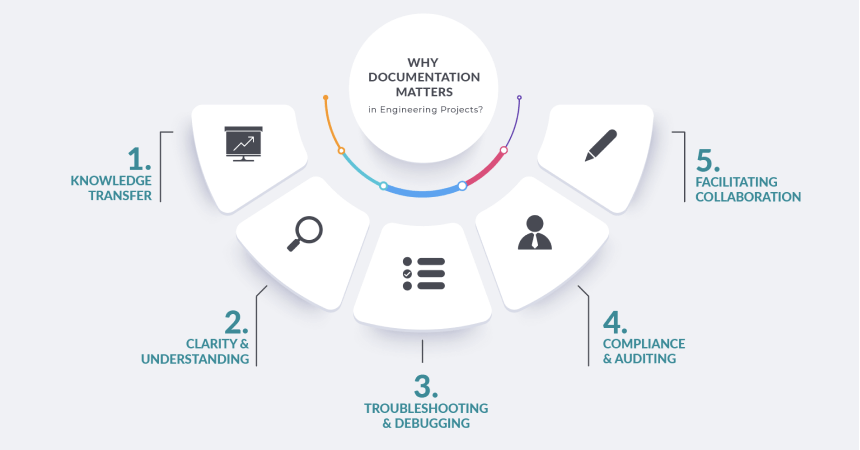
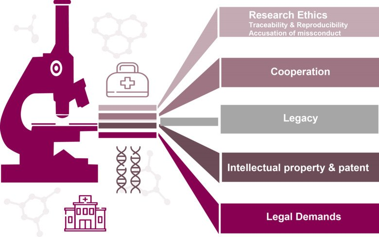
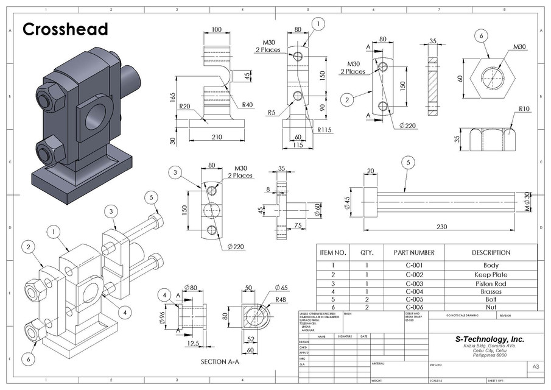
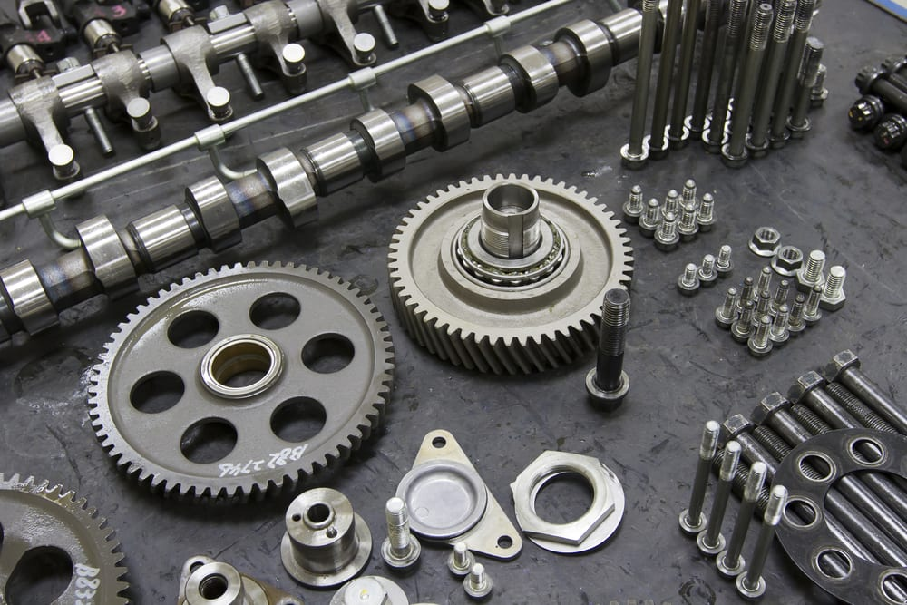
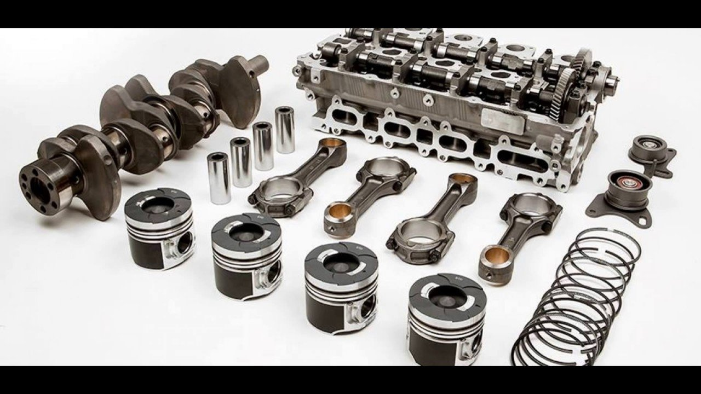
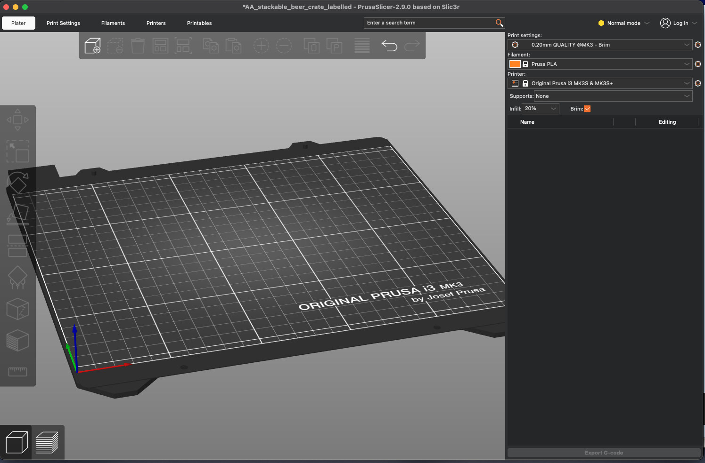
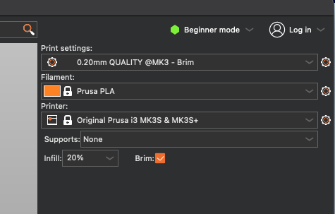

## Week 2 Content

General plan is engineering documentation, extrusions for Fusion, and generating gcode from .stl files for lab.

### Day 1 (Monday)

### Engineering Process and Documentation

* Review from previous week: questions, clarifications, etc. COCC admin issues?

* Articulate the general plan from above.

* Specific Fusion questions/issues from week 1 assignments (we will validate sketching skills this week)

* Engineering Documentation: Why? 
<blockquote>
    
    * Story from graduate school about notebooks

    * Story from Boeing about electrical revs

    * Story from Tyler about dimensions/drawings

    * Fly's Eye code documentation
    
</blockquote>

* Acknowledge that many variations in the tasks that scientists and engineers do. Some are more open and free form and others more repetitive or critical. Important enough that there is a competitive industry of folks providing tools to support this.

* A framework for why...
  

from [Lantro](https://www.lantrotech.com/)

[the whole article](https://www.lantrotech.com/blog/the-power-of-engineering-documentationa-comprehensive-guide/)

Discuss context in which each mode might apply.

Another perspective from staff guidelines at a major university....

from [Karolinska Institute](https://ki.se/en)

[the whole article](https://staff.ki.se/research-support/research-data-management/why-should-research-be-documented)

Again, discuss context

* Relevance in this class:
<blockquote>
    
    * Good notetaking in class is a version of documentation

    * Lots of steps in processes we are learning. Keeping track

    * My experience recently with Prusa Slicer
    
</blockquote>

* Example: [NASA Technical Standards](https://standards.nasa.gov/nasa-technical-standards)

Standards for everything -- why? Does SpaceX have something similar? Why or why not? Ford? 

* Writing Skills: [iFixit Tech Writing Manual](https://about.ifixit.com/Tech_Writing)

I think this is probably all we will have time to disucss today. Think about how you can begin a more effective documentation process going forward and what skills you might want to develop. As get deeper into the design of objects we will talk more about the details of generating engineering drawings specifically.

### Day 2 (Wednesday)

### Fusion Sketching Check In:

* Talk briefly about the centrality of 'sketches' to the design process.

Discuss what sort of sketches might be useful for different parts of the cross head. What do you notice?

Mostly what sorts of sketches would you be using?

...and here?

#### What does this tell us?

#### Constraints

(pull up Fusion and sketch a wonky quadrilateral) What makes this different than a square or a rectangle? How might I get there? Did I need to be uptight in the begining?

* While some groups are working with the printers the rest of the groups will be exploring where everyone is at with creating sketches. (real time with Fusion on the board)

### Prusa Slicer Discussion/Lab Prep

**Options for slicers:** Slicers are an integral step in all 3D printing. There are a number of options of which Prusa Slicer, Ultimaker Cura, and Slic3r are probably the 3 most common. If you can use one you can probably find your way around one of the other ones. I'm sure there are plenty of custom in house slicers for folks like the ones at Relativity. We will use Prusa Slicer but if you take courses from our Graphic Design program I think they use Ultimaker Cura. No worries...

**Configuring your Prusa Slicer:** For most personal copies of Slicer you want it to know what printers you commonly work. This smooths your workflow. Use the first few minutes of [this Tutorial from 3D Revolution](https://www.youtube.com/watch?v=_kIqMPNQNSw) to guide you through using the Configuration Wizard the first time you open Prusa Slicer.

**Note:** I'm not sure at the moment whether the configurations are set on Slicer on the lab computers. I will update this note when I know.

**Another Note:** Mostly what I am doing here is adding my thoughts to Prusa's [First Print with Slicer](https://help.prusa3d.com/article/first-print-with-prusaslicer_1753) tutorial. 

### Bruce's Notes for Class:

If you are doing this independently jump to the asynchronus notes below which should roughly replicate what I intend to do in class.

**Prep:** Download both the hollow cube .stl file and the tweezer .stl file. Also save a custom print setting with 5 layer brim so it can be used.

* **Open Slicer** and note general form of desktop and the printer build plate that matches our printer.

* **Open Configuration Assistant** and quickly walk through the menus.

* **Import tweezers.stl from the [tools folder](https://github.com/smithrockmaker/ENGR102/tree/main/3DPrinters/stlFiles/tools)** (or Another_Hollow_Cube.stl from the [test folder](https://github.com/smithrockmaker/ENGR102/tree/main/3DPrinters/stlFiles/test))

* **Explore Standard Settings** in the top right of the desktop. Look through "Print settings", "Filament", and "Printer". Discuss choices. Note "brim" and "Infill" options.

* **Discuss Modes:** I will expect the class to learn to work in the Advanced mode. Strong cautions about Expert mode:)

* **Placing the object on the plate:** Mouse to change viewpoint. Drag, rotate in different directions, and place on differet 'flats'. We are not worrying about the rest of the menu options at this point. Discuss how placement potentially affects bridging challenges.

* **Scaling:** There are many reasons to consider scaling an object. Note the ability to lock all scale factors together or scale independently. Discuss how the tweezers ended up scaled ONLY along the long axis.

* **Explore other primary menus along top:** Note what happens as you change the user mode. Note what happens When you load a custom user preset (changes color of submenu) Note how many choices you have that you need not worry about until you have a need. It's like trying to understand all the menu options on any software package. What do we need to think about at this time?

* **Slice** the model and note what has changed.
<blockquote> 
    
    * Note that bottom left menu pair has shifted from model view to sliced view. 
    
    * You can see all the basic features of the print for your choices. 
    
    * Note particularly the print time near bottom of legend window. 
    
    * Icons along the bottom help visualize particular features of the print process that you may have embedded in the print. 
    
    * Note in the window that pops up in bottom right you can see length of filament used in print. 
    
    * Note that you can zoom in on the sliced print and see different features of the print (decode from legend window)

* **To make changes** return to model view (bottom left), make changes, and reslice. You will do this a couple of times for the lab.

* **Export G-code:** When you're happy with your print then export the G-code (as a .gcode file for our Prusa printers -- if you get something else you have a printer setting issue:) This is the .gcode file that you will add to the SD card and take to the printer.

### Asynchronus Version of Slicer Discussion

**Prusa Slicer Desktop** 

This is the image of the Slicer desktop for my current version which should be close to yours. At the end of this discussion you should be able to return to this image and identify a range of important features and menus.

As you can see it provides you with a visualization of the build plate from our Prusa printers. This is comforting.

**Basic Settings:**

In the top right corner of the desktop is a summary of the basic settings that are currently in force for Slicer. There are three (3) major drop down menus available. (ignore the mode menu for now)

* First (top) menu defines print quality generally. More specifically it sets the layer thickness and some other quality parameters depending on your needs.

* Second menu sets the filament type that you intend to use for this model (object). This affects temperatures and other features of the print. For us this will ALWAYS be Prusa PLA unless we get some other filaments.

* Third menu tells Slicer what printer it is creating commands for. This is the choice that can really confuse the process if you get it wrong. The particular printers we have are MK3S+. The information about the MK3S+ is loaded when you run through the configuration wizard during setup. If you have access to more than one printer this is an easy setting to forget to adjust.

* There is a check box at the bottom of this section to tell Slicer that you want a 'brim' around the edge of your print. I am recommending this for all of our prints. Probably being too cautious but it doesn't slow the print down significantly and minimizes adhesion problems.

**Skill Mode:**

Just above the menus we have just discussed is a mode menu

