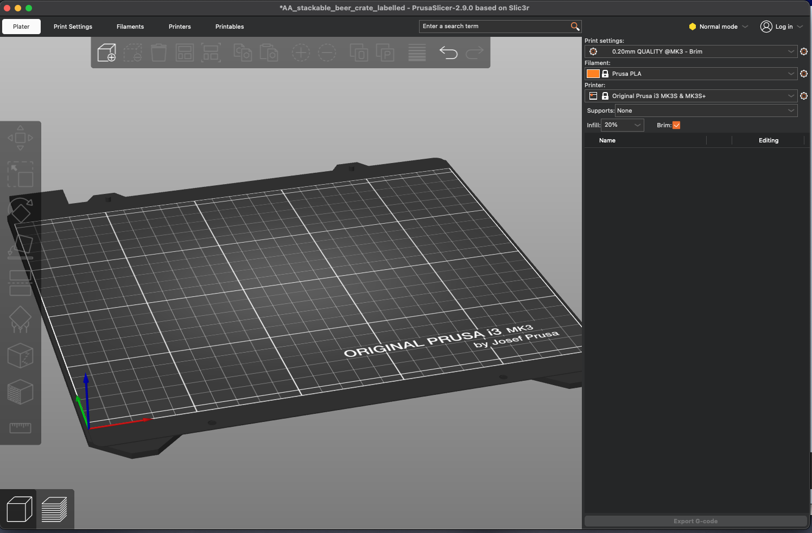
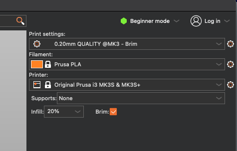
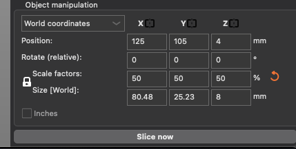
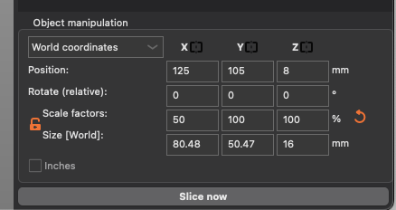

## Week 3 Content

General plan is engineering documentation, extrusions for Fusion, and generating gcode from .stl files for lab.

### Day 1 (Monday)

### MLK Holiday and the Peaceful Transfer of Power

### Day 2 (Wednesday)

### Fusion Sketching Check In:

### When we get to Lab:

While some groups are working with the printers the rest of the groups will be continuing to explore and develop their Fusion skills including executing current and past Fusion Skills Assessments.

### Prusa Slicer Discussion/Lab Prep

**Options for slicers:** Slicers are an integral step in all 3D printing. There are a number of options of which Prusa Slicer, Ultimaker Cura, and Slic3r are probably the 3 most common. If you can use one you can probably find your way around one of the other ones. I'm sure there are plenty of custom in house slicers for folks like the ones at Relativity. We will use Prusa Slicer but if you take courses from our Graphic Design program I think they use Ultimaker Cura. No worries...

**Configuring your Prusa Slicer:** For most personal copies of Slicer you want it to know what printers you commonly work. This smooths your workflow. Use the first few minutes of [this Tutorial from 3D Revolution](https://www.youtube.com/watch?v=_kIqMPNQNSw) to guide you through using the Configuration Wizard the first time you open Prusa Slicer.

**Note:** I'm not sure at the moment whether the configurations are set on Slicer on the lab computers. I will update this note when I know.

**Another Note:** Mostly what I am doing here is adding my thoughts to Prusa's [First Print with Slicer](https://help.prusa3d.com/article/first-print-with-prusaslicer_1753) tutorial. 

### Bruce's Notes for Class:

If you are doing this independently jump to the asynchronus notes below which should roughly replicate what I intend to do in class.

**Prep:** Download both the hollow cube .stl file and the tweezer .stl file. Also save a custom print setting with 5 layer brim so it can be used.

* **Open Slicer** and note general form of desktop and the printer build plate that matches our printer.

* **Open Configuration Assistant** and quickly walk through the menus.

* **Import tweezers.stl from the [tools folder](https://github.com/smithrockmaker/ENGR102/tree/main/3DPrinters/stlFiles/tools)** (or Another_Hollow_Cube.stl from the [test folder](https://github.com/smithrockmaker/ENGR102/tree/main/3DPrinters/stlFiles/test))

* **Explore Standard Settings** in the top right of the desktop. Look through "Print settings", "Filament", and "Printer". Discuss choices. Note "brim" and "Infill" options.

* **Discuss Modes:** I will expect the class to learn to work in the Normal mode. Strong cautions about Expert mode:)

* **Placing the object on the plate:** Mouse to change viewpoint. Drag, rotate in different directions, and place on different 'flats'. We are not worrying about the rest of the menu options at this point. Discuss how placement potentially affects bridging challenges.

* **Scaling:** There are many reasons to consider scaling an object. Note the ability to lock all scale factors together or scale independently. Discuss how the tweezers ended up scaled ONLY along the long axis.

* **Explore other primary menus along top:** Note what happens as you change the user mode. Note what happens When you load a custom user preset (changes color of submenu) Note how many choices you have that you need not worry about until you have a need. It's like trying to understand all the menu options on any software package. What do we need to think about at this time?

* **Slice** the model and note what has changed.
<blockquote> 
    
    * Note that bottom left menu pair has shifted from model view to sliced view. 
    
    * You can see all the basic features of the print for your choices. 
    
    * Note particularly the print time near bottom of legend window. 
    
    * Icons along the bottom help visualize particular features of the print process that you may have embedded in the print. 
    
    * Note in the window that pops up in bottom right you can see length of filament used in print. 
    
    * Note that you can zoom in on the sliced print and see different features of the print (decode from legend window)

* **To make changes** return to model view (bottom left), make changes, and reslice. You will do this a couple of times for the lab.

* **Export G-code:** When you're happy with your print then export the G-code (as a .gcode file for our Prusa printers -- if you get something else you have a printer setting issue:) This is the .gcode file that you will add to the SD card and take to the printer.

### Asynchronus Version of Slicer Discussion

**Prusa Slicer Desktop** 

This is the image of the Slicer desktop for my current version which should be close to yours. At the end of this discussion you should be able to return to this image and identify a range of important features and menus.

As you can see it provides you with a visualization of the build plate from our Prusa printers. This is comforting.

**Standard Settings:**

In the top right corner of the desktop is a summary of the basic settings that are currently in force for Slicer. There are three (3) major drop down menus available. (ignore the mode menu for now)

* First (top) menu defines print quality generally. More specifically it sets the layer thickness and some other quality parameters depending on your needs.

* Second menu sets the filament type that you intend to use for this model (object). This affects temperatures and other features of the print. For us this will ALWAYS be Prusa PLA unless we get some other filaments.

* Third menu tells Slicer what printer it is creating commands for. This is the choice that can really confuse the process if you get it wrong. The particular printers we have are MK3S+. The information about the MK3S+ is loaded when you run through the configuration wizard during setup. If you have access to more than one printer this is an easy setting to forget to adjust.

* There is a check box at the bottom of this section to tell Slicer that you want a 'brim' around the edge of your print. I am recommending this for all of our prints. Probably being too cautious but it doesn't slow the print down significantly and minimizes adhesion problems. For "Infill" set to 15% as a starting point.

**Skill Mode:**

Just above the menus we have just discussed is a mode dropdown menu. The names of the modes are slightly different in different generations of the software but Beginner, Normal, and Expert are pretty good descriptors. 

Switch between modes at each step in this weeks lab to see the differences in the options and layout of the software. We will typically work in Normal mode for this class. In Expert mode you can break things by telling the printer to do unwise things -- don't make changes here unless you're sure you know what you're doing!!

**Place Object (.stl file):**

On the icon menu at the top of the desktop frame the left most icon allows you to add an object to the build plate. Find the desired .stl file (tweezers.stl in this case) and open it.

When you open the .stl file it will drop the object in the middle of the build plate oriented as it was generated in the CAD software. This the original tweezer object from which I made the tweezers at each printer station.

By selecting the object (turns green on my version) you can drag it around on the build plate. With your mouse you can rotate the build plate to see the object from different perspectives. The scroll wheel will usually zoom in and out. Ultimately we are looking to position the object on the build plate in a way which maximizes the outcome of the print.

The icon menu to the left offers a couple of commonly useful options. The 'rotate' icon pops up these handles on the object.

Using those handles we can reorient the object in arbitrary ways. The orientation shown below is NOT going to work well for many reasons not the least of which is that it isn't sitting on the build plate.

Another option in the left menu is the 'place on face' option. Whe this is selected Slicer highlight the various flat planes that exist on the model.

Selecting a highlighted plane places that plane flat on the build plate. This is a good tool for being sure that your object is flat on the build plate. Consider the consequences of your choices. The choice indicated below is also NOT wise given other much better choices. 

The original orientation of this object as imported is actually pretty good.

**Scaling:**

The tweezers are an example of an object which might be scaled. For me these tweezers seemed overly large. Scaling an object is a useful option in many cases. In the bottom right corner is another object manipulation menu. For today we are interested in the scaling part of the menu.

The lock icon next to the Scale Factors/Size indicates that scaling in any one direction will be automatically applied to all directions. Selecting the lock (which turns the lock orange) allows you to scale differently along different axes. This icon color change shows up in other places in Slicer.

If I lock the scales and reduce the tweezers to 50% of their original size (in all directions) it looks like this.

..which looked like this...

When I printed these tweezers they were to flexible so I unlocked the axes and scaled them only in x (the length) to get....

These are what are at each printer and they work pretty well I think.

You can also scale by adjusting the length along an axis instead of a percentage. Looks pretty similar....

**Slicing:**

Once you are satisfied with your object placement, orientation, and scaling now it's time to slice it. This is why it's called Slicer:) In the object manipulation window where we were playing with the scaling there is a button for "Slice now". This executes the code for slicing the object into layers.

The image of your object will change colors and all the physical features of the print will be shown on the build plate.

The key to interpreting the sliced image is in the legend that appears in the top left of the build window. The drop down menu at the top allows you select various characteristics of the print to display. For the time being the "Feature type" option is probably the most useful. Of particular interest is the total print time displayed at the bottom of the legend window.

**NOTE:** On the bottom and right of the build windows are now slicers that represent 'time' (on the bottom) and 'layer' (one the right). Manipulating layer slider allows you to see the details of each layer.

Manipulating the time slider allows you to see the path of the nozzle and the gcode which drives it. 

If you decide that you want to change something go to the bottom left of the build window and select the model view (left) instead of the layer view (right). This will return you to the unsliced model mode and you can make changes and then reslice the model.

**Export G-code:**

Once you have sliced your object you will see a new window in the bottom right below the object manipulation window. This window, the Sliced Info window will indicate how much filament the print will use along with reiterating the estimated print time (generally pretty good estimate). 

When you are ready export the G-code to a file/folder on your computer. This is the file that you will load onto an SD card. We gave SD card reader dongles next to each printer to facilitate copying the G-code file to the SD card. Choose your file name wisely so you can find it on the SD card. I recommend adding your initials or some 3 character identifier to the head of the file name. 

**Go Print!**

If all goes well your print will come out as you intended. If not, then back to either the design to modify it or to Slicer to change the print characteristics.
