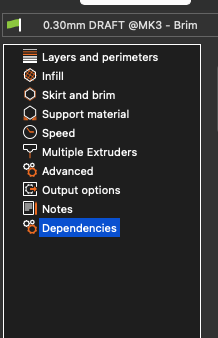
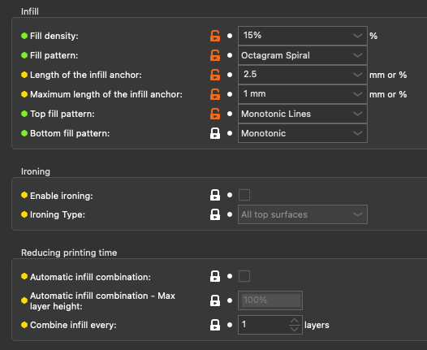
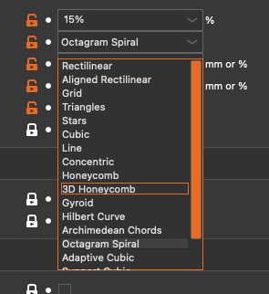
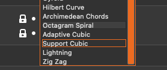

## Week 3 Content

General plan is engineering documentation, extrusions for Fusion, and generating gcode from .stl files for lab.

### Day 1 (Monday)

### MLK Holiday and the Peaceful Transfer of Power

No class today. Discussions begin next week about Engineering Design processes.

### Day 2 (Wednesday)

### Fusion Check In:

Only a few folks have completed the first Fusion Skills activity. Do you have questions?

Other general questions about the Fusion tutorials?

### Fusion Skills 2

This weeks Fusion Skills activity is primarily about simple extrusions. Here is the link to the activity [FusionSkills2](https://github.com/smithrockmaker/ENGR102/blob/main/Fusion360/Skills/FusionSkills2.md). We'll review it.

At the end of the skills description there is a reference to [Fusion Screenshot Expectations](https://github.com/smithrockmaker/ENGR102/blob/main/Fusion360/ScreenShotExpectations.md). We will review this document as well to help align everyone's understanding of best practices for this class.

### Fusion Classroom Activity

**Notes for Bruce**

* Have Fusion up and running ahead of class
  
* Start with sketching a rectangle on the base plane and extrude it upwards 50 mm (random student)
  
* Add a circle that is bigger in diameter than the rectangle to the **SAME** plane as a separate sketch. Extrude up and down 40 mm. Want to end up with 2 'towers' standing on base plane (random student)

* New sketch on plane perpendicular to base plane. Sketch a circle that is 'small' and will cut through at least one of the previous extrusions. Extrude through and join to previous elements of model. (random student)

* New sketch on remaining plane that is 'small' square. Extrude and cut through as many of the previous extrusions as possible (random student)

* Change one of the sketches in a way which changes the intersection of the cut with the previous extrusions (random student)

* Finally, add a fillet to one of the edges of one of the rectangles. (random student)

**Random Student Selection:**

1: Pick student, get day of birth, take last digit and count rows. Odd on right even on left. Pick another student:)

2: Next student, get day of birth, take day number and count down the row cycling if needed. That student goes to board.

3: Student at board picks next student, back to 1:

### When we get to Lab:

While some groups are working with the printers the rest of the groups will be continuing to explore and develop their Fusion skills including executing current and past Fusion Skills Assessments.

### Prusa Slicer Discussion/Lab Prep

**Configuring Prusa Slicer on Lab Computers:** If you are using the lab laptops you will need to rerun the configuration wizard since these computers are reset every night. 

### Bruce's Notes for Class:

If you are doing this independently jump to the asynchronus notes below which should roughly replicate what I intend to do in class.

**Prep:** Download both the InfillTest.stl file. 

* **Open Slicer and Import InfillTest.stl**
  
* **Position model on plate (not in center)** and choose basic settings. Be sure to use a brim. As we change some of the print settings remember to save the changes with a useful profile name. Do you remembe how to lay it flat? The shape was created to allow a variety of ways for the infill to interact with the perimeters.

* **Layers and Perimeters** To expose the infill we need to remove the top layers (set to 0). You will be asked to change the number of perimeters in each of your prints to have some appreciation of it's impact on rigidity and print times. Save the print setting profile at this point.

* **Infill Choice** There are currently 18 infill patterns. Why would we need to many? Two articles discussing the impact of infill choices: [Article 1](https://help.prusa3d.com/article/infill-patterns_177130) and [Article 2](https://blog.prusa3d.com/everything-you-need-to-know-about-infills_43579/)

* **Slice and Assess** For me estimated print times were 10 ish minutes more or less.

* **Export G-code to File/SD Card** When you're satisfied with the slice export the G-code. Repeat this process for each of the infill patterns your group is assigned. 

* **Go Print** We will collect all your print sample at the back of the class for everyone to examine

### Asynchronus Version of Infill Discussion

**Prusa Slicer Setting Menu** 

Assuming everything from last weeks lab is still in your mind we will start here with the Print Settings menu (Normal mode).

Note that when change anything within one of these menu items it will change color until we save the printer profile (probably with a new name).

**Layers and Perimeters:**

In order to show the interior structure of the infill we need to not cover it with the normal solid layers at the top. If you go to the Layers and Perimeters menu you will see a set of control choices for the Horizontal shells. If the lock is white the parameter is Locked. If the lock is open and orange you can change it. Normally there are 4 or so solid layers at the top. Set this down to 0 layers. This would be a good place to save the profile for today's lab.

**Perimeters:**

Later on you will change the number of perimeter layers just to get and understanding of what that looks like. For now leave it at 2.

**Infill:**

Go to the Infill menu which looks like this. What we will be playing with are the Fill patterns.

* **Infill Dropdown Options:** Here, in two images, are all the infill patterns available on our machines.

This is where you choose which infill pattern to use for your print. You can print with different infills in different parts of a print but that's beyond our skill set at the moment.

