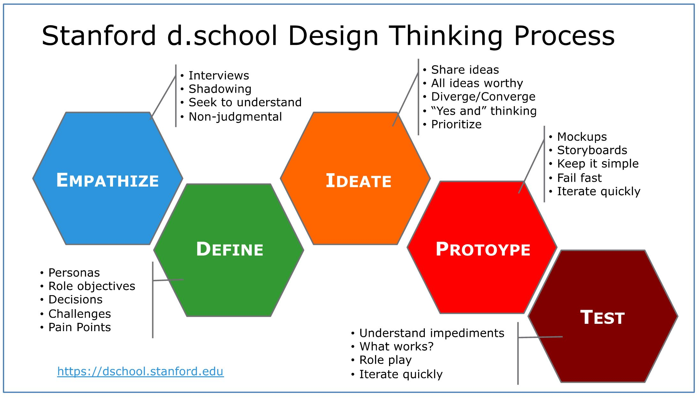
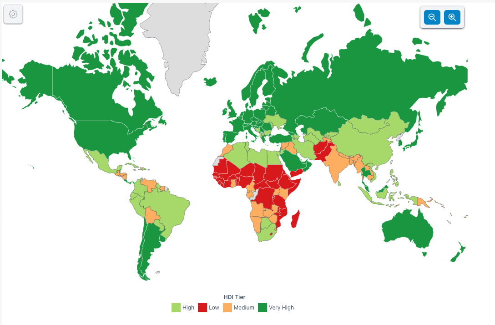
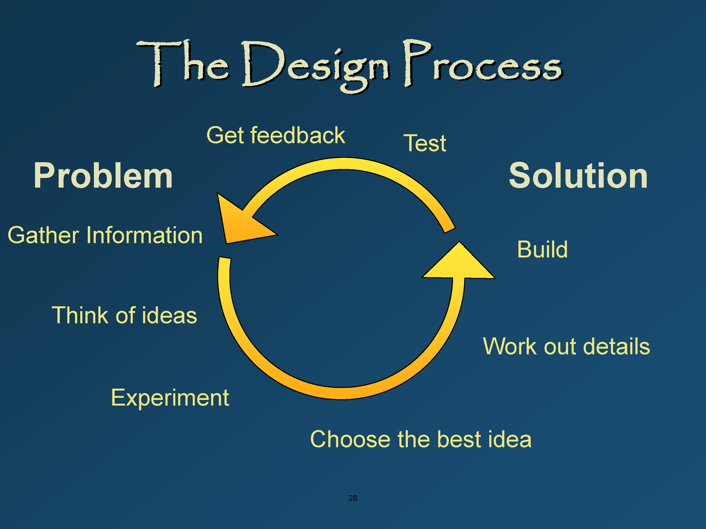
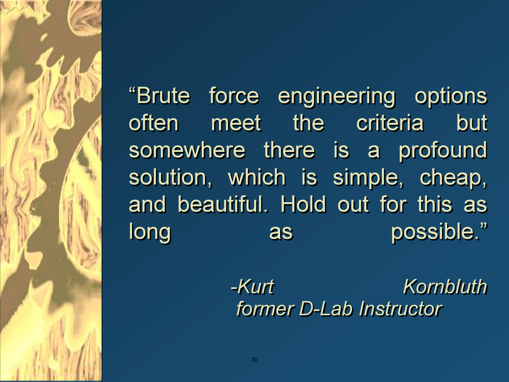
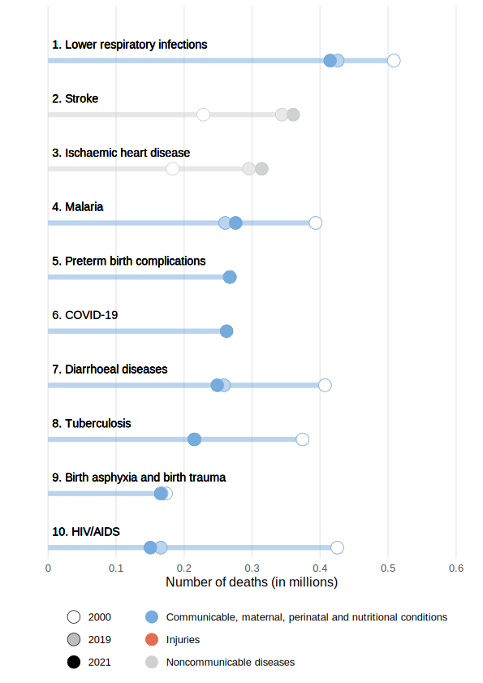

## Week 5 Content

General plan is engineering documentation, extrusions for Fusion, and generating gcode from .stl files for lab.

### Day 1 (Monday)

### Engineering Design:

As we introduce a different design system lets keep the 'Silicon Valley' model in the back of our minds.

### Design for the World: D-Lab/MIT

In this country and the rest of the developed world we tend to experience engineering through the technological solutions and products it creates for our lives. We, however, are not particularly typical of how most folks in the world live. Just for reference here is the world map of the Human Development Index for all the countries in the world.

There are many things we could talk about in this image bur for today I want to just note that in spite of the visual appearance only about 20% of the globe (about 1.5 billion people) has a lived experience that is reasonably close to ours. China is almost part of that group and when it reaches the same stage in the next couple of years the percentage of those living at the highest level will double given that the population of China is about 1.5 billion. 

Amy Smith created the [D-lab at MIT](https://d-lab.mit.edu/) to teach all of us how engineering can improve the lives of those who do NOT live in what is called the developed world. As the mission of the D-Lab says - 'designing for a more equitable world'.

I first cross paths with Amy Smith through [her TED talk](https://www.ted.com/talks/amy_smith_simple_designs_to_save_a_life) in 2006. At this point she had just started the D-Lab at MIT and had recently received the MacArthur Fellowship ('genius grant'). Because our time in class is limited we will probably not watch this video in class but I encourage you to do so on your own time. She is an important voice in engineering design. This approach to engineering is sometimes associated with what is called appropriate technology.

In the class notes (linked below) Amy clarifies the following terms which I find very useful.

<blockquote> 
<b>Invention</b> – to be the first to make or use something, the vanguard
    
<b>Design</b> – working out the details form and structure

This is D-Lab Design, not I-Lab Invent!
You don’t have to have an invention in order
for it to be a design.

<b>Innovation</b> - looking at something, and using it in a new way. Not
necessarily the first to use it, but in a certain way.
</blockquote>

If this purpose driven form of engineering interests you many of the D-Lab courses are available through [MIT's OpenCourseWare project](https://ocw.mit.edu/search/?q=d-Lab). Here is the basic design flow as envisioned by the folks at the D-Lab.

We'll talk about similarities and potential differences from our previous design flow. 

As Amy points out in a number of places when you're trying to live on the equivalent of $1/day the economics of engineering solutions becomes a huge driver of the design solutions. A former D-Lab instructor made this statement about searching for design solutions in this environment.

Lastly we'll chat about the Pugh Chart as a tool for evaluating how a proposed design relates to existing solutions.

To dig into this deeper the following links are the D-Lab Design Packet and the D-Lab Design Class Notes. I found both made great reading.

[D-Lab Design Packet](https://github.com/smithrockmaker/ENGR102/blob/main/documents/D-Lab/DLabDesignPacket.pdf)

[D-Lab Design Class Notes](https://github.com/smithrockmaker/ENGR102/blob/main/documents/D-Lab/DLabDesignClassNotes.pdf)

### Design Exercise: $2/Day

Amy has her students live on $2/day for a week (food, transportation, and entertainment) as a way to generate some empathy for folks living in less developed parts of the world. Amy does NOT include housing, net work access, or medical expenses. However, she does tell them no taking mercy food from friends or family. 

* Be careful - some of those places are quite close to use here in the US. Cuba and Haiti come to mind.

In groups discuss how you might succeed at this assignment in your lives here in Bend. In round numbers you need 2000 - 2500 calories (kcal) of food to keep your body running. See what you know about the following ideas:

* What are the cheapest calories in the supermarket?

* How would you prepare food if you didn't have access to electricity or gas?

* Do you know who you would ask for a ride to school (and back) in such circumstances? They are not allowed to make a special trip for you:)

* Can you (legally) salvage roadkill in Oregon? Deer, squirrels, rabbits? Do you need a permit? [Oregon Rules for Roadkill Salvage](https://myodfw.com/articles/roadkill-salvage-permits)

Amy's intention (and mine) is to get you to think about how challenging it is keep body and soul together if you have to do everything from scratch. There is almost no time for anything else for billions of people on the planet.

If we have time we'll discuss causes of mortality in low income countries.

Here's the link to [similar data for all countries and income levels.](https://www.who.int/news-room/fact-sheets/detail/the-top-10-causes-of-death)

### Day 2 (Wednesday)

### Fusion Check In:

Everyone should have been through Kevin's tutorial on shop drawings as well as the lofting exercise (the bottle) and the ice cube tray. I expect that you are feeling a bit more comfortable with Fusion at this time.

### Fusion Skills 3

This weeks Fusion Skills activity is primarily about shop drawings and modifying from the timeline. Here is the link to the activity [FusionSkills3](https://github.com/smithrockmaker/ENGR102/blob/main/Fusion360/Skills/FusionSkills4.md). We'll review it.

For this skills assessment you are turning in the pdf's (exported) of the shop drawings from your two versions of the toy block.

### Project #1: 

For the next couple of weeks you will be working on your first design project for this class. We will discuss these guidelines in class. I have an example from my own recent work that may be helpful.

[Project #1 Guidelines:](https://github.com/smithrockmaker/ENGR102/blob/main/Projects/Project1/Project1Guidelines.md)
  
### Supervised Printing: (possibly)

I may have a model for supporting supervised printing when we are not in lab. This is tentative.

### When we get to Lab:

While some groups are working with the printers the rest of the groups will be continuing to explore and develop their Fusion skills including executing current and past Fusion Skills Assessments.

### Lab Prep: Toy Blocks

The purpose of this weeks lab prints see how well our models of toy blocks ('lego blocks) are doing. You will print out at least one of each while working on other things.

**PLEASE NOTE:**

* While I appreciate the desire to hurry things along please DON'T speed up the printer through the 'tuning' menu. We're hoping that these printers have a long life and pushing their operating parameters has risks for their longevity.

**Brims Today!** In the typical orientations for printing the toy blocks there is not a lot of surface area on the build plate. This suggests that brims are a prudent choice.

### Design: Engineering Assessment

With any luck I will have some actual Lego bricks for you to test your printed models against.

