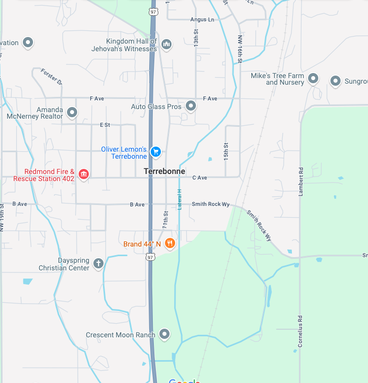

## Week 5 Content

General plan is engineering documentation, extrusions for Fusion, and generating gcode from .stl files for lab.

### Day 1 (Monday)

### Engineering Design:

As we introduce a different design system lets keep the 'Silicon Valley' model in the back of our minds.

### Design for the World: D-Lab/MIT

In this country and the rest of the developed world we tend to experience engineering through the technological solutions and products it creates for our lives. We, however, are not particularly typical of how most folks in the world live. Just for reference here is the world map of the Human Development Index for all the countries in the world.

There are many things we could talk about in this image bur for today I want to just note that in spite of the visual appearance only about 20% of the globe (about 1.5 billion people) has a lived experience that is reasonably close to ours. China is almost part of that group and when it reaches the same stage in the next couple of years the percentage of those living at the highest level will double given that the population of China is about 1.5 billion. 

Amy Smith created the [D-lab at MIT](https://d-lab.mit.edu/) to teach all of us how engineering can improve the lives of those who do NOT live in what is called the developed world. As the mission of the D-Lab says - 'designing for a more equitable world'.

I first cross paths with Amy Smith through [her TED talk](https://www.ted.com/talks/amy_smith_simple_designs_to_save_a_life) in 2006. At this point she had just started the D-Lab at MIT and had recently received the MacArthur Fellowship ('genius grant'). Because our time in class is limited we will probably not watch this video in class but I encourage you to do so on your own time. She is an important voice in engineering design. This approach to engineering is sometimes associated with what is called appropriate technology.

If this purpose driven form of engineering interests you many of the D-Lab courses are available through [MIT's OpenCourseWare project](https://ocw.mit.edu/search/?q=d-Lab). Here is the basic design flow as envisioned by the folks at the D-Lab.

We'll talk about similarities and potential differences from our previous design flow.

To dig into this deeper the following links are the D-Lab Design Packet and the D-Lab Design Class notes. I found both made great reading.

### Design Exercise:

(form groups of 4-6)

You are all aware of the traffic along Hwy 97 has been getting greater and greater. In the Bend area the average daily traffic count is between 30,000 and 50,000 in the latest Oregon data. Even north in Terrebonne that number is only cut in half to somewhere between 15,000 and 30,000 vehicles daily. This is between 20 and 40 cars every minute passing through Terrebonne. Locals are aware that taking a left onto Hwy 97 at most times during the day is a fools errand. Most visitors to Smith Rock State Park are not so clear on the concept. 

Let's take this as a civil engineering design problem and consider possible solutions using the Design Thinking approach.  Below is a map of Terrebonne pretty much from end to end.

A couple of data points you may wish to consider. The local elementary school is on B Street just off of Hwy 97 to the West (left). The junction at the North end of Terrebonne across from the Kingdom Hall feeds  Crooked River Ranch which has a population of roughly 5000 folks. On a busy day between 500 and 1000 cars take a right on Smith Rock Way to go to the park. Mostly they come back the same way.

Given all that....

**Empathise:** (1 min solo, 2 min consolidate, 2 min report out)
What are the pain points for users?

**Define:** (1 min solo, 2 min discuss, 2 min report out)
What are some requirements/objectives for a design solution?

**Ideate:** (1 min solo, 3 min discuss, 3-4 min report out)
This is what you know as brainstorming. See how it feels in your group.

**Prototype/Test:** (class discussion 5-10 min)
How does one explore the various possible solutions that come from the ideation phase.

If we have time we can look at [ODOT's solution](https://github.com/smithrockmaker/ENGR102/blob/main/documents/DesignDocs/TerrebonneProjectMap.pdf).

### Day 2 (Wednesday)

### Fusion Check In:

Everyone should be done with the first 3 videos from Kevin and Lars collectively. This weeks skills assessment is a version of the project Lars did.

### Fusion Skills 3

This weeks Fusion Skills activity is primarily about simple extrusions. Here is the link to the activity [FusionSkills3](https://github.com/smithrockmaker/ENGR102/blob/main/Fusion360/Skills/FusionSkills3.md). We'll review it.

At the end of the skills description there is a reference to [Fusion Screenshot Expectations](https://github.com/smithrockmaker/ENGR102/blob/main/Fusion360/ScreenShotExpectations.md). We will review this document as well to help align everyone's understanding of best practices for this class.

### Fusion Classroom Activity: Engineering Drawings

**Notes for Bruce**

* Have Fusion up and running ahead of class
  
* Load up toy block and demonstrate the basic tools needed from the Day 29 tutorial

* Export pdf to illustrate generating this document for submission to Canvas

### When we get to Lab:

While some groups are working with the printers the rest of the groups will be continuing to explore and develop their Fusion skills including executing current and past Fusion Skills Assessments.

### Lab Prep: Articulated Objects

The purpose of this weeks lab prints is to explore how folks make print in place flexible objects. One way of describing such objects is that they are articulated. All of the objects that I have provide take in the range of 60 min to print so getting the print going, and handing the printer off to the next group, will be important in completing the task.

Now that you, in principle, know how to safely use the 3D printers and understand the workflow from downloading an .stl file to loading the G-Code onto the printer I will be giving much less explicit directions about the process. Please refer to past lab notes if you are uncertain.

**PLEASE NOTE:**

* While I appreciate the desire to hurry things along please DON'T speed up the printer through the 'tuning' menu. We're hoping that these printers have a long life and pushing their operating parameters has risks for their longevity.

* **NO BRIMS TODAY!!** Because of the way articulated objects are constructed they tend to adhere well to the build plate and the brims just add friction and little bits of plastic that we have to break off to allow them to flex.

### Design: Reverse Engineering

You will have plenty of time to consider how these flexible objects are constructed. Typically the creators of these objects do not share the CAD file (although sometimes they do) so it's not always clear how the models are created. Because you can move up and down through the stack of slices on Slicer you should be able to visualize how the creator did it. This is one deliverable for the lab. NO: You are NOT being asked to create a Fusion model of the articulating structure -- sketch and describe only.

