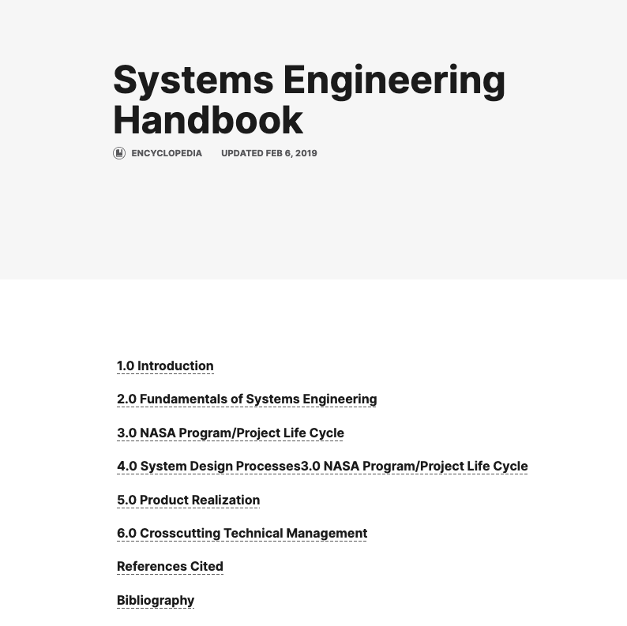
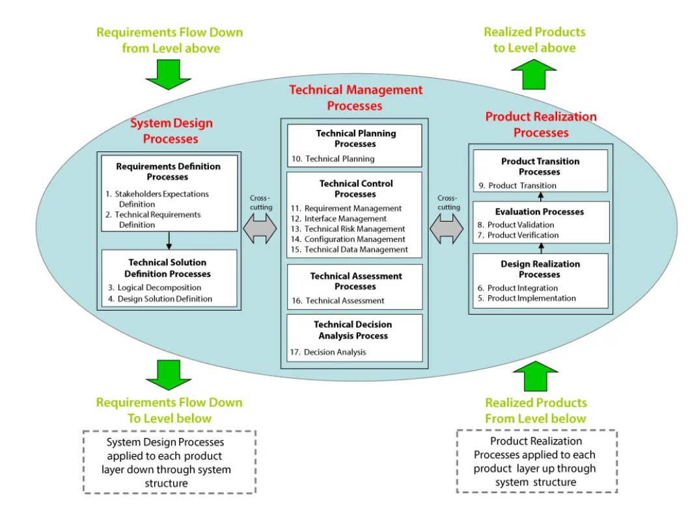
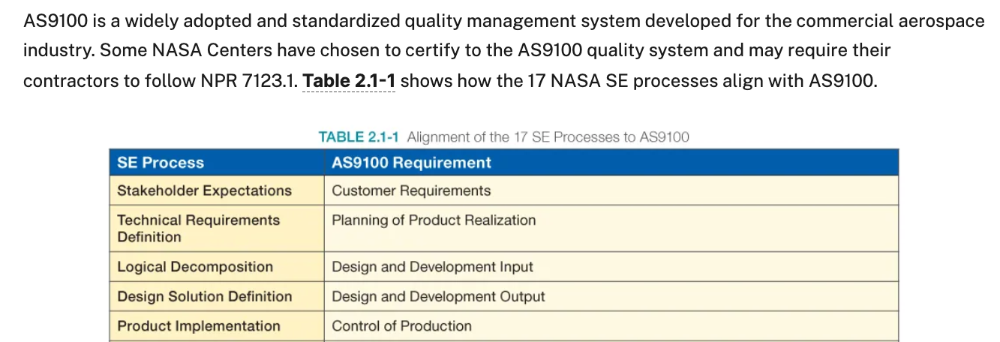
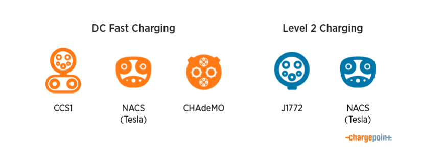

## Week 6 Content

General plan is systems engineering, engineering standards, and on going work on your projects

### Day 1 (Monday)

### Systems Engineering:

The last couple of weeks we have considered a couple of different perspectives on what might be called engineering project design. The dschool and the D-Lab havevery similar processes with slightly different emphases because of the target user. Today we are going to discuss what happens in more complex systems consisting of many different 'objects' working together to achieve a particular outcome.

**Class Discussion:** 

Create student generated list on board. Discuss factors we might use to assess their relative 'system-ness'. (10-15 min)

<blockquote>

* Factors that raise the bar

* Is there anything except safety?

* What about just general complexity?

* Where does a system that NASA/SpaceX builds fall on this spectrum?

</blockquote>

### Systems Engineering at NASA:

Lets take a look at the way NASA does systems engineering.....

[Systems Engineering Handbook: Home](https://www.nasa.gov/reference/systems-engineering-handbook/)

Here is a screen shot of the table of contents.

[Systems Engineering Handbook: Fundamentals](https://www.nasa.gov/reference/2-0-fundamentals-of-systems-engineering/)

Enormous amounts to explore but let's start here. Can we even understand this fundatmental representation?

Looking a little further down we find this statement.....

What the heck is AS9100? What is an engineering standard? Why might they exist?

There are a number of standards organizations and many of them overlap and have equivalent standards.

[ASTM (American Society of Testing and Materials)](https://www.astm.org/)

[SAE (Society of Automotive Engineers)](https://www.astm.org/)

[ISO (International Organization for Standardization)](https://www.iso.org/home.html)

How does one know that these standards are being met? Compliance?

[This can happen](https://www.oxebridge.com/emma/damning-dod-report-cites-68-major-nonconformities-at-three-as9100-certified-firms/)

What are your thoughts?

### Examples:

**EV Charging:**

What's your sense of the current state of chargers? Here are the relevant standards

[ISO 15118](https://www.iso.org/standard/69113.html)

[SAE J1772](https://www.sae.org/standards/content/j1772_201710/)

Here are the current crop of charger heads out there.....can you feel the pain?

**Open Badges:**

You may have received or been aware of badges in Canvas. They may seem a little unserious but because of their standard they are quite capable of replacing standard grades and diplomas if anyone wanted to. This is possible because a relatively modest group of folks have spend time over the last 15 years to build a standard that addresses most of the issues and concerns.

[Open Badge Standard](https://www.imsglobal.org/spec/ob/v3p0/cert/)

It' a complicated read but if one creates a digital badge that meets these requirements than all badge systems that recognize the standard will be able to accept and interpret your badge. This is what makes them useful in the larger world. 

### Day 2 (Wednesday)

### Fusion Check In:

* Are my notes useful?

* How far behind is everyone - blind poll with hands. Lesson 8: Door Stop is target.

<blockquote>
    
  Lesson 7: Bike Handle
    
  Lesson 6: Hex Nut
  
  Lesson 5: Ice Cube Tray
  
  Lesson 4: Lofted Bottle
  
  Lesson 29: Shop Drawings
  
</blockquote>

### Project #1: Checkin

[Project #1 Guidelines:](https://github.com/smithrockmaker/ENGR102/blob/main/Projects/Project1/Project1Guidelines.md)

You've had 5 days or so to starting looking for an object that might address a 'pain point' you have. How's that going? Questions? Sharing? Everybody still have their approval sheets?

### When we get to Lab:

Lab time this week and next are set aside for doing test prints and final prints for your projects. We will assess next week whether additional time is needed.

