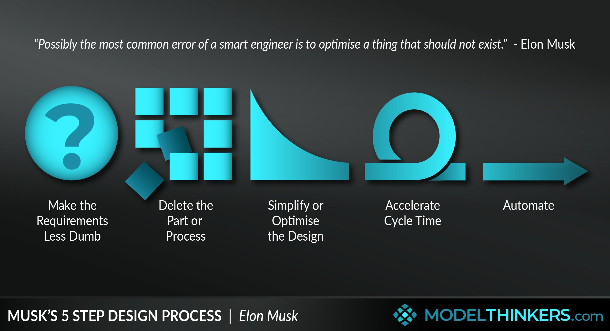
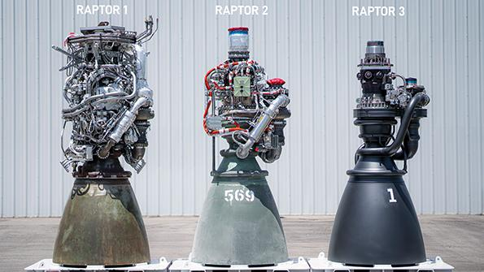

## Week 7 Content

General plan is exploring the 5 Step Engineering process used in various Musk companies. Continue growing Fusion skills and working on Project #1.

### Day 1 (Monday)

### 5 Step Engineering Process:

Given the world we live in I think we have to acknowledge that the large scale engineering projects associated with Elon Musk require some discussion. We will explore the structure of the 5 Step Engineering Process used at Space X, Tesla, and other companies. We will connect this to other engineering design systems like DFX and discuss whether this process is fundamentally different or has a different implementation and emphasis. 

A couple of things before we dive in. We will do our best to focus on the engineering and technology development aspects of the undeniably important impact that Elon Musk has had on our world. Every effort will be made to keep current politics out of the discussion.

**Full Disclosure:** Having been involved in discussions in the past about forming a collaboration between Tesla and COCC's EV Automotive program I am not impressed with Tesla as a partner and collaborator. Feel free to call me on it if I get snarky.

**Class Discussion:** 

Create student generated list on board. Discuss factors we might use to assess their relative 'system-ness'. (10-15 min)

<blockquote>

* Factors that raise the bar

* Is there anything except safety?

* What about just general complexity?

* Where does a system that NASA/SpaceX builds fall on this spectrum?

</blockquote>

### 5 Step Engineering Process:

[This is a good review article for the 5 Step Process.](https://www.superengineer.net/blog/dfx-elon-musk-design-method)

**1: Make the requirements less dumb**

Elon: "Your requirements are definitely dumb; it does not matter who gave them to you. It's particularly dangerous if a smart person gave you the requirements because you might not question them enough (...) everyone is wrong some of the time."

Consider......

| |         | |

What are the requirements? How might you make them less 'dumb'? Who gets to decide what 'dumb' is? Do you think these were designed to the same requirements?

**2. Delete the part or process step**

Elon: "If you're not deleting a part of the process step (...) basically if you're not adding things back in 10% of the time, you're clearly not deleting enough."

Look back at the tools - what could you take away that would make it non-functional? What could you remove that only reduces functionality - does it still meet requirements?

**3. Simplify or optimize**

Elon: "The reason this is the third step is cause it's very common, possibly the most common error of a smart engineer is to optimize the thing that should not exist."

Hard to tell from the image how much of the cleaning up of the engine design is deleting unnecessary parts and how much is simplification. Gotta keep checking back to be sure safety or some other requirement doesn't get compromised in the simplification.

**4. Accelerate cycle time**

Elon: "You're moving too slowly; go faster! But don't go faster until you've worked on the other three things first because if you are digging and you are great, don't dig it faster; stop digging your grave.

This is closely related to the Silicon Valley idea of move fast and break things. As is commonly pointed out you need to have done the first three steps well so that you're not making a lot of stuff with built in error. This is sometimes described as **"If you’re digging your grave, don’t dig faster!”**

This might be a good point to discuss external factors in this design process. NASA uses public dollars to create value. Space X is maybe using more private dollars. Do we, as the public, react the same if a very expensive rocket blows up on the launch pad? Why is that? Aren't public funds paying for some or much of Space X's work?

**5. Automate**

Elon: "Then the final step is to automate."

This is very much a production focused idea. It is based on the idea that any repetative production process should be automated if possible. Automation does things faster and more consistently than humans. On the other hand if adaptation and interpretation is needed then humans are generally better at the task.

It's true that Step 3 can be used to redesign to support more automation in production (all other things being equal). However, the desire to automate doesn't override earlier steps in the design process. All of this is easier if all of the steps in the production process are vertically integrated.

**Vertical Integration:**

What is vertical integration in engineering product development? In it's most extreme case vertical integration is when a product producer owns every part of the manufacturing of it's product as well as the delivery to the ultimate consumer. This can be very efficient and it facilitates many of the steps in the 5 Step Engineering Process described above. On the other hand it also means that the business needs to have significant expertise in many different parts of the design and manufacturing process. A case in point is Telsa building it's own battery factories and charger factories. Challenging to develop the expertise but ultimately reduces the risk of supply chain disruptions which have plagued many battery dependent industries.

I raise this point to be sure you recognize that any given engineering design process is also impacted by the product environment that it works in. There are no simple answers which is why it's fun:)

### Day 2 (Wednesday)

### Fusion Check In:

* Are my notes useful?

* How far behind is everyone - blind poll with hands. Lesson 8: Door Stop is target.

<blockquote>
    
  Lesson 7: Bike Handle
    
  Lesson 6: Hex Nut
  
  Lesson 5: Ice Cube Tray
  
  Lesson 4: Lofted Bottle
  
  Lesson 29: Shop Drawings
  
</blockquote>

### Project #1: Checkin

[Project #1 Guidelines:](https://github.com/smithrockmaker/ENGR102/blob/main/Projects/Project1/Project1Guidelines.md)

This week you should be well on your way to building the Fusion model of your object for Project #1. How's that going? Questions? Sharing? Everybody still have their approval sheets?

### When we get to Lab:

Lab time this week is set aside for doing project prints. We will assess whether additional time is going to be needed. Next week we will explore printing compliant structures.

