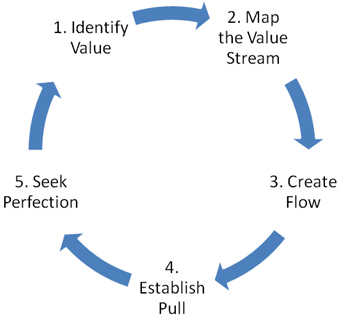

## Week 8 Content

This week we explore some of the basic ideas embedded in various 'lean' engineering and manufacturing processes. We continue developing our Fusion skills and will also explore compliant structures in 3D printing.

### Day 1 (Monday)

### Lean in Engineering and Manufacturing

'Lean' is a processk that is near and dear to the heart of some folks I have worked with over the years at COCC. They have had direct experience with the value that 'lean' brings to both engineering and manufacturing processes. The work I have done in the world has had much less 'lean' in it due to the nature of instrumentation based investigative science. I say this to acknowledge that I am not even remotely an expert in these ideas but I deeply believe that many of you will eventually work in places or institutions where 'lean' processes will be important. 

When MIT makes it part of their engineering curriculum seems like we should all take note. [MIT Opencourseware 16-660J](https://ocw.mit.edu/courses/16-660j-introduction-to-lean-six-sigma-methods-january-iap-2012/pages/syllabus/) is a lean manufacturing course taught in the Aeronautics and Astronautics Engineering Systems Division. 

Here are some descriptions of 'Lean' Engineering:

<blockquote>
Lean Engineering is about finding and getting rid of anything that doesn’t truly help the customer. By pinpointing and removing these “non-value” parts, companies can streamline their process, use resources better, and cut costs while pleasing customers more.

Based on the proven principles of lean manufacturing, lean engineering has evolved to handle engineering teams’ unique challenges.
</blockquote>

From the ASME (American Society of Mechanical Engineers):**5 Key Lean Principles for Engineers**

<blockquote>
 Long considered a way to greatly improve manufacturing efficiency, lean can be applied to any business or production process, in any industry. When done correctly, lean can create huge improvements in efficiency, cycle time, productivity, leading to lower costs and improved competitiveness. 
</blockquote>

### The Challenge:

For crying out loud 'Lean' everything is an industry and there are many large companies keeping lots of folks employed training other folks in these methods. If it were simple and quick that wouldn't happen. We are going to scratch the surface and nothing more but that doesn't mean it's not important. The article below is as clear as any I have read and most of what follows comes from here.

[**5 Key Lean Principles for Engineers (ASME)**](https://www.asme.org/topics-resources/content/5-lean-principles-every-should-know)

A lovely graphic to be sure but what does it mean? As we go through these steps be thinking about your breakfast routine (if you have one) and how you might apply these lean principles.

#### 1. Value

Value is always defined by the customer’s needs for a specific product. For example:

    What is the timeline for manufacturing and delivery?
    What is the price point?
    What are other important requirements or expectations that must be met?

This information is vital for defining value.

#### 2. Value stream

Once the value (end goal) has been determined, the next step is mapping the “value stream.” This includes all the steps and processes involved in taking a specific product from raw materials and delivering the final product to the customer.

Value-stream mapping is a simple but eye-opening experience that identifies all the actions that take a product or service through any process—design, production, procurement, HR, administration, delivery, or customer service. The idea is to draw a "map" of the flow of material/product through the process, with a goal of identifying every step that does not create value and then finding ways to eliminate those wasteful steps.

#### 3. Flow

After the waste has been removed from the value stream, the next step is to be sure the remaining steps flow smoothly with no interruptions, delays, or bottlenecks. In the words of LEI: “Make the value-creating steps occur in tight sequence so that the product or service will flow smoothly toward the customer.”

#### 4. Pull

With improved flow, time to market (or time to customer) can be dramatically improved. This makes it much easier to deliver products as needed, as it means the customer can “pull” the product from you as needed (often in weeks, instead of months).

As a result, products don’t need to be built in advance or materials stockpiled. This reduces the need for an expensive inventory that needs to be managed, saving money for both the manufacturer/provider and the customer.

#### 5. Perfection

Accomplishing steps 1-4 is a great start, but the fifth step is perhaps the most important: making lean thinking and process improvement part of your corporate culture. Every employee should be involved in implementing lean.

As gains continue to pile up, it is important to remember that lean is not a static system and requires constant effort and vigilance to perfect. Lean experts often say that a process is not truly lean until it has been through value-stream mapping at least half a dozen times.

### The 8 Wastes of Lean Engineering

**Overproduction**

Overproduction refers to performing more work or producing more components than is necessary. 

In the context of engineering, this can manifest as designing additional features or functionalities that are not required by the customer or prematurely terminating projects that could have added value.

**Waiting**

Waiting encompasses any idle time between different steps of a process, such as when team members are waiting for information, resources, or approvals to proceed with their work. 

This form of waste can significantly hinder productivity and delay project timelines.

**Transportation**

Transportation waste relates to the unnecessary movement of tools, materials, or information. In engineering environments, this can include excessive or manual transfer of data, as well as time spent searching for information that should be readily accessible.

**Motion**

Motion waste refers to the unnecessary movement of people, such as engineers or technicians moving between different work areas or locations. 

This type of waste can impact efficiency and contribute to fatigue, potentially leading to errors or missed opportunities for improvement.

**Overprocessing**

Overprocessing occurs when work is performed that is unnecessary or does not add value to the customer. 

Examples in engineering include creating detailed reports when a simple update would suffice or running additional tests that are not required for the project’s success.

**Overstorage**

Overstorage waste arises when organizations store more materials, parts, or finished products than necessary. 

In engineering environments, this can also manifest as excessive collection and retention of data or information or the accumulation of unfinished developments or projects.

**Defects**

Defects represent products, services, or processes that fail to meet customer expectations. 

In engineering, this can include errors in design or construction that require revisions, rework, or corrections, leading to delays and increased costs.

**Unused talents**

Lean Engineering recognizes that one of the most significant sources of waste lies in the underutilization of human potential. 

When an organization fails to leverage the talents, skills, and knowledge of its employees, it misses out on valuable opportunities for innovation and improvement.

**Class Activity:** 

Consider your personal breakfast routine. How do each of the 5 Principles apply to that routine.

<blockquote>

* What is the **actual value?**

* What is the **value stream?**

* How do you improve the **flow of value?**

* Are you responding to the **pull** from the customer?

* How can you **perfect** the process?

</blockquote>

We will discuss in class:)

### Day 2 (Wednesday)

### Fusion Check In:

* Questions

* Project Questions: Next week you will be getting your final project guidelines even though we have a fair amount of time until the end of the term.

### Project #1: Check in

[Project #1 Guidelines:](https://github.com/smithrockmaker/ENGR102/blob/main/Projects/Project1/Project1Guidelines.md)

This week you should be well on your way to building the Fusion model of your object for Project #1. How's that going? Questions? Sharing? Everybody still have their approval sheets?

### When we get to Lab:

Lab time this week is set aside for doing project prints. We will assess whether additional time is going to be needed. Next week we will explore printing compliant structures.

