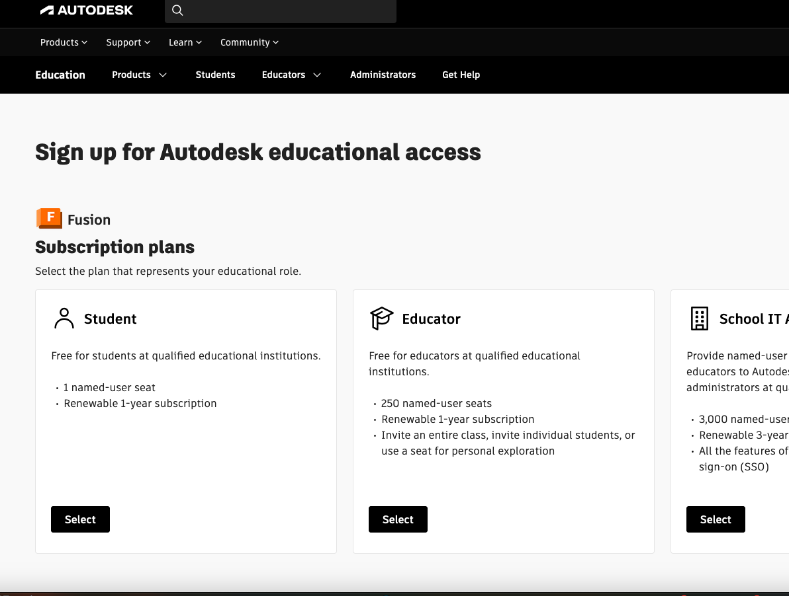

## Digital Resources:

[Bruce's github](https://github.com/smithrockmaker/ENGR102/tree/main)

### Installing software (not apps)

**NOTE!!** It may be that you have never actually installed a piece of software on your computer. This is NOT quite the same as installing an app on your phone. If you have never done this before come and ask in class or visit the IT helpdesk in Pioneer Hall. Over the years I have seen some unexpected things happen when I assume that you know how to do this. 

### Fusion 360 Software:

Autodesk is a large company that makes a CAD product called, surprisingly, AutoCAD. A few years ago they built a product called Fusion 360 which is also a CAD product very much like AutoCAD or Solidworks as an entry point for education and non professionals. For the time being you can get and use a fully functional version of Fusion 360 if you are a student or in the field of education.

Start here at the [Autodesk Fusion Education webpage] which should look something like below.

Choose the Student portal. Use your COCC email address which is what validates that you are a student.

After that Autodesk will need some institutional information about COCC. You can pull what you need of the image below. Pick a graduation date like 06/27 well in the future.

At this point it's hard for me to reproduce what your experience will be since I already have an account and the alternative email I gave them doesn't register as a COCC education address. You will be required to set up an Autodesk account which will be used to validate your Fusion software so use good digital hygiene in choosing and saving your password! 

Once you complete the process (which may require confirmation from your COCC email account) you can download the Fusion 360 client onto your computer. You can actually install on more than one machine but it can only be running in one location at a time. 

If you are successful your Fusion desktop should look something like below when you open it. Note it will have your account name and the indication for the Education License.

### Slicer Software:

The original idea for a personal 3D printer has sort of the same trajectory as Microsoft and Apple for personal computers. Some folks felt like this was an important idea and set out to make it real. That project is [RepRap](https://reprap.org/wiki/RepRap). This is one of many open source projects and even the commercial 3D printers we are using in the lab are only modestly modified RepRap 3D printers. Everything you need to physically build a modest 3D printer can be found on the RepRap wiki. Along with the physical printer there are a number of software and firmware packages that are needed to make the whole system work. Slic3r is the 'slicer' (which we will talk about in class) that was originally built for the RepRap project. Josef Prusa has built onto that open source software package to create Prusa Slicer which we will use in this class. The raw software is still available on the github if you are so inclined. Having said all that what we need to do is have Prusa Slicer installed on our personal computers.

[Prusa Slicer downloads](https://www.prusa3d.com/page/prusaslicer_424/) can be accessed at [https://www.prusa3d.com/page/prusaslicer_424/](https://www.prusa3d.com/page/prusaslicer_424/) (both links are the same!). The webpage will automatically suggest which version is appropriate for your computer. Download and install the software. 

### CAD Learning:

While there are 

[Learn Fusion 360 in 30 Days: Day 1](https://www.youtube.com/watch?v=d3qGQ2utl2A&list=PLrZ2zKOtC_-C4rWfapgngoe9o2-ng8ZBr&index=2)

[Fusion 360 for Absolute Beginners: 1](https://www.youtube.com/watch?v=A5bc9c3S12g&list=PL40d7srwyc_Ow4aaOGXlP2idPGwD7ruKg)

[File Export Format Discussion](https://www.jaycon.com/exporting-3d-files-stl-vs-obj-vs-iges-vs-step/)

### 3D Printing Learning:

When you need to download the Prusa Slicer software: [Prusa Slicer](https://www.prusa3d.com/page/prusaslicer_424/)

[Beer crate battery holder](https://www.thingiverse.com/thing:6761838/files)

[Toothpaste Squeezer](https://www.thingiverse.com/thing:867811/files)

[Muppet Labs](https://muppetlabs.co/3d_printing.html)

[Rambo Board Schematics](https://github.com/ultimachine/RAMBo/blob/master/docs/RAMBoSchem.pdf)

[Einsy Rambo](https://reprap.org/wiki/EinsyRambo)

[Prusa G-code](https://help.prusa3d.com/article/prusa-firmware-specific-g-code-commands_112173)

[Hackaday Satellite Dish (potential project)](https://hackaday.com/2024/12/23/handheld-satellite-dish-is-3d-printed/)

[Hackaday Crawlers](https://hackaday.com/2024/12/23/crawler-challenge-building-rope-traversing-robots/)

[Mechanical Test of 3D Parts:](https://engineerdog.com/2015/09/02/mechanical-testing-3d-printed-parts-results-and-recommendations/)

[Infill Guide](https://explore3dprint.com/3d-print-infill-a-comprehensive-guide/)

[LEGO design guide](https://hackaday.com/2024/12/27/ldu-decoded-the-untold-tale-of-lego-dimensions/)

[Use Case: Ocean Going Laboratory](https://www.matterhackers.com/articles/creating-custom-3d-brackets-for-an-ocean-going-laboratory)

[Torture Test Prints](https://www.3dsourced.com/guides/test-3d-prints-calibration/)

### Compliant Design

[BYU Compliant Mechanisms Group](https://compliantmechanisms.byu.edu/maker-resources)

[BYU Compliant Mech Group Thinkiverse Site](https://www.thingiverse.com/byu_cmr/designs)

[All3DP Compliant](https://all3dp.com/2/compliant-mechanisms-3d-print/)

[Hackaday Compliant Design](https://hackaday.com/tag/compliant-mechanism/)

[Hackaday Printed Buttons](https://hackaday.com/2019/07/06/3d-printed-buttons-printed-as-a-single-unit/)

[Hackaday Wire Connector](https://hackaday.com/2021/02/15/print-in-place-connectors-aim-to-make-wiring-easier/#more-461077)

[Hackaday Compliant Bed Sensor](https://hackaday.com/2020/07/15/no-assembly-required-for-this-compliant-mechanism-dial-indicator/)

### Interlocking Parts

[Connecting Joints Review](https://3dprinterly.com/how-to-3d-print-connecting-joints-interlocking-parts/)

[Interlocking Design](https://3dinsider.com/3d-printing-interlocking-parts/)

[More Interlocking Designs](https://3dcentroamerica.com/misc/3d-print-interlocking-parts.html)

### Design Reference Webs

[Coin Sizes](https://www.thecoinsupplystore.com/pages/coin-size-guide#!)

### Engineering Design Methodology

**SpaceX** 

[The Algorithm](https://aviationweek.com/space/commercial-space/algorithm-spacexs-five-step-process-better-engineering)

[Five Step Design](https://www.superengineer.net/blog/dfx-elon-musk-design-method)

[Model Thinkers](https://www.modelthinkers.com/mental-model/musks-5-step-design-process)

**DFMEA**

[DFMEA](https://www.ansys.com/blog/what-is-dfmea)

**DLab**

**NASA**

[NASA Systems Engineering](https://www.nasa.gov/reference/2-1-the-common-technical-processes-and-the-se-engine/)

[NASA Systems Design Process](https://www.nasa.gov/reference/4-0-system-design-processes/)

