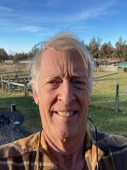

#### Bruce Emerson: Instructor

As you can tell I've been around a while. What's probably relevant to you in the context of this course is that I taught physics and engineering at COCC for 30 years before retiring a couple of years ago. I have taught nearly every course in the program and created some of them. I am a builder and maker who loves to learn about almost anything.  I'm really looking forward to teaching this course and  working with you as you progress through your/our program. Check the Office Hours: Contact page to see when I am most available in person or online.