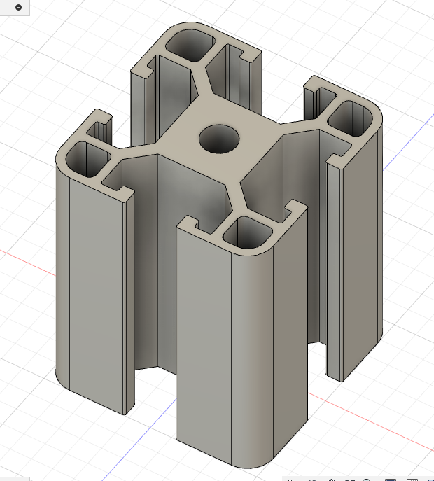

## Fusion Screenshot Expectations:

There are a number of ways we might validate your successful completion of a Fusion exercise or skills assessment. Certainly uploading the xxx.f3d file to some service or emailing to your instructor is an option. 

In some cases a quick assessment of your efforts can be made from a simple screenshot of your model in the Fusion 360 desktop. What follows are some guidelines for what to include in any such screenshot that you upload.

### Current Best Practice

Here is a screenshot that meets our current expectations.

A couple of things to notice.

* The component name and/or the file name describe the assignment
* All the browser tabs are open for the bodies and sketches
* The home view of the model is presented
* The model history timeline is visible at the bottom.

### Possible Missteps
Here are some screenshots to avoid:

Only the model - no other data.

Browser tabs are closed -- makes it hard to see the structure of your solution to the assignment.

Everything is open but sketches are turned off.

It would be easy to miss the history timeline at the bottom. Take the time to be sure it's included.

Don't forget to be sure all aspects of the model are potentially visible via the Object Visibility options in the Display Settings at the bottom edge of your desktop.

