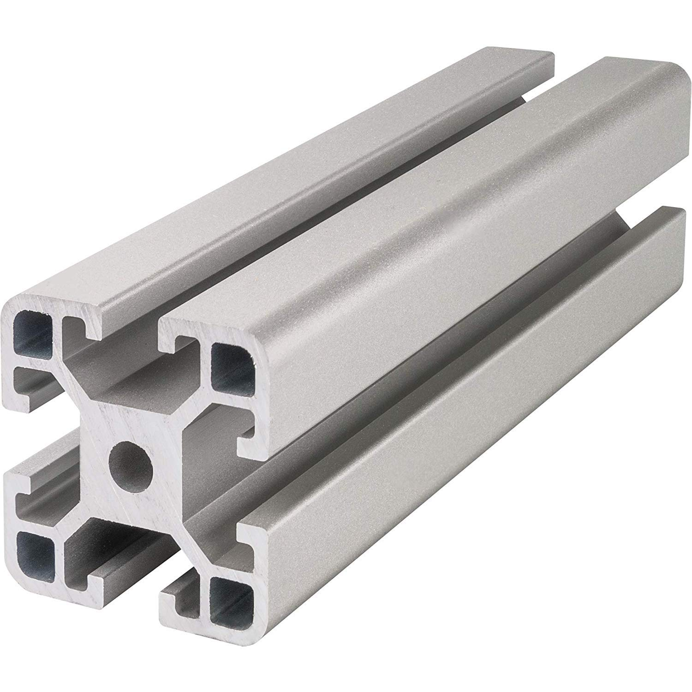
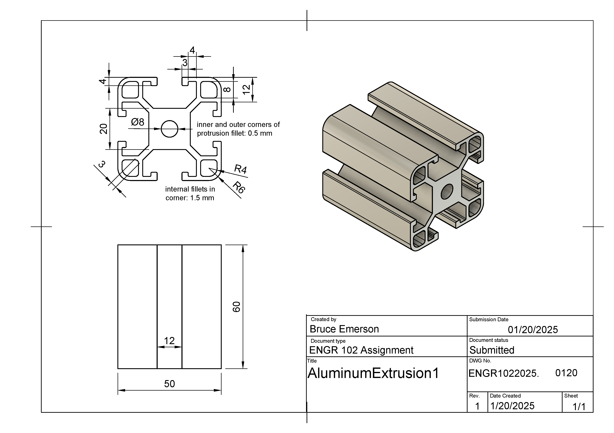

## Fusion Skills Assessment: 

### Extruding

Your task for this Skills Assessment is to create the aluminum extrusion illustrated below.

This is the image of a typical extruded aluminum bar that I found.

Here is the shop drawing from my Fusion file meant to recreate the extrusion...

You can download this [image as a pdf here](https://github.com/smithrockmaker/ENGR102/blob/main/documents/Assessments/AluminumExtrusion1Drawing.pdf) and print it out if you wish.

### Task 1:

Create a new component called AluminumExtrusion. Create a sketch on bottom plane and extrude it into a rectangular column consistent with the engineering drawing.

### Task 2:

On the top face of the previous extrusion create a sketch or sketches that you need to create the cuts you will need to create this extrusion. Give it a try without referring to any videos. If you get stuck then consider where you have seen a technique used and review the videos. I will also link some hints here if you are having difficulties.

I found creating various construction lines combined with mirroring very helpful in building this sketch. 

For the purposes of this Skills Assessment you are NOT permitted to use the Pattern>Circular tool to create the overall extrusion. 

### Task 3:

Apply the specified fillets to one corner of the extrusion. You can do all the extrusions if you feel motivated to do so but once you've done one corner I'm convinced that you can do it.

### Assessment Verification

For this assessment taking a screen shot of your completed extrusion and submitting it to Canvas will be sufficient. Please refer to this [Fusion Screenshot Expectations](https://github.com/smithrockmaker/ENGR102/blob/main/Fusion360/ScreenShotExpectations.md) document for guidance.