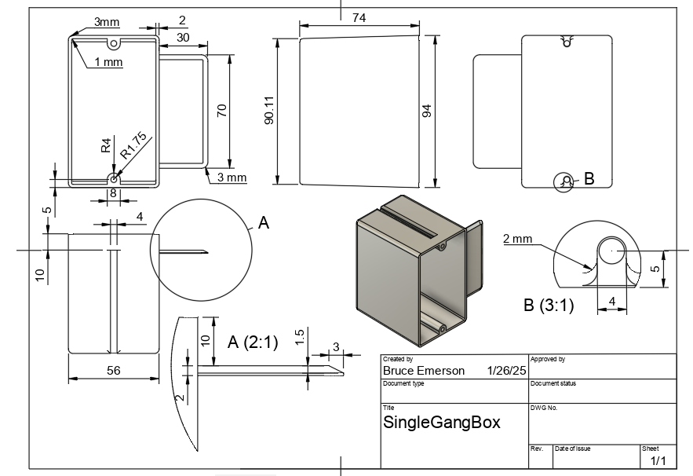

## Fusion Skills Assessment: 3

### Extruding

I was looking around my shop for an object that was similar to the tutorials you have been working on. Eventually I landed on this single gang electrical box. There is more to this model than I have rendered but I think this will provide a challenging exercise for many of you.

Here is an image of the shop drawing from my Fusion file for this electrical box

You can download this [image as a pdf here](https://github.com/smithrockmaker/ENGR102/blob/main/documents/Assessments/SingleGangBoxDrawing.pdf) and print it out if you wish.

### Task 1:

Create a new component called SingleGangBox.Take a good look at the drawing and consider your approach to creating this box given that it tapers in one direction. 

### Task 2:

Choosing an appropriate plane on which to sketch create the main volume of the box. Extrude and then use the Shell command to hollow it out with the correct width. 

### Task 3:

Create an offset construction plane. Create another sketch of the 'wing' on the side of the box and extrude appropriately. Continue working on the wing to round the corners with the fillet tool and then use the chamfer tool from the modify menu to create the tapered edge of the 'wing'. You will need to use the 2 distance type of chamfer which you may not have tried yet. Time to explore.

### Task 4:

Add the internal ribs, screw holes and clearances to the box. This is a bit fussy but is a good test of your organizational skills. I found a variety of construction lines and mirroring helped this process move smoothly. Think about where the centers of various features are as you do this. Finish by adding all the requested fillets.

### Assessment Verification

For this assessment taking a screen shot of your completed extrusion and submitting it to Canvas will be sufficient. Remember to turn on all of the bodies, sketches, and construction planes so they are visible in your screenshot. Please refer to this [Fusion Screenshot Expectations](https://github.com/smithrockmaker/ENGR102/blob/main/Fusion360/ScreenShotExpectations.md) document for guidance.