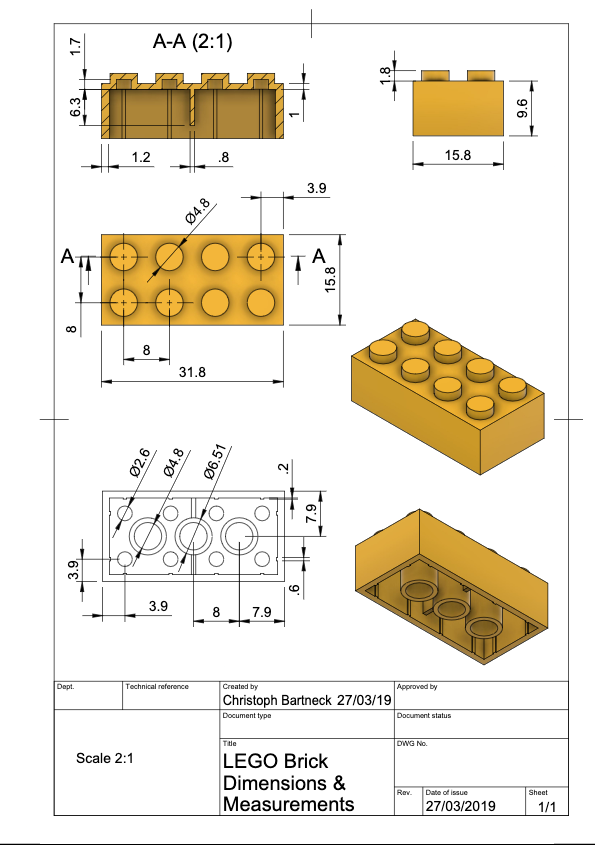

## Fusion Skills Assessment: 4

### Shop Drawings

We talked about the importance of shop drawings both for fabrication and communication last week. This week we're going to use shop drawings to improve our toy block ('lego block') model so that it matches actual 'lego block' standards

### Task 1:

Create a shop drawing from your Fusion toy block model. This first task asks you to make sure that you have shown all the relevant dimensions that went into creating the model following Kevin's directions. At the same time you might as well export the .stl file for this block since you will be printing it out this week in lab. Also export a pdf of the shop drawing to turn in for this skills assessment

### Task 2:

Compare the dimensions and features of your toy block with those of Chris Bartneck [website is here if you prefer](https://www.bartneck.de/2019/04/21/lego-brick-dimensions-and-measurements/). Identify the differences. 

### Task 3:

Make a copy of your Toy Block file with 'updated' in the filename. Revisit the appropiate points in the timeline to modify various sketch features so that the updated block matches Chris Bartnecks shop drawing. There are a couple of small features that are not on our original toy block that you will need to figure out where to add via a new sketch.

Create a new shop drawing that is laid out the same way as your previous one. Keeping the format the same makes it easier to notice differences. 

Also export this model as a .stl file and the shop drawing as a pdf to turn in.

### Assessment Verification

For this assessment turn in both shop drawings to Canvas. No screenshots needed this time.