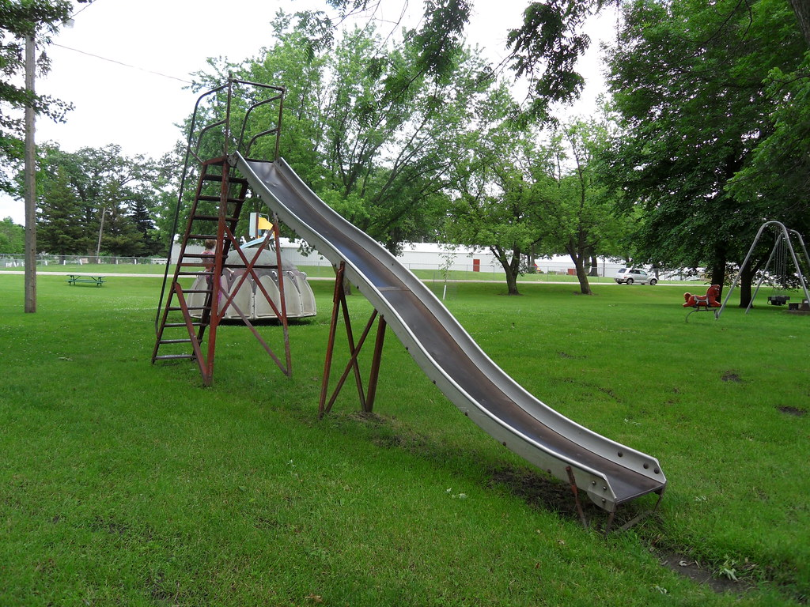

## Fusion Skills Assessment: 6

### Create path, sweep profile, add bodies

This time you will be working from an image. I am ultimately not terribly concerned with exact dimensions here though human realities suggest certain limits on your choices. I suspect that you will imagine a number of ways to do this assessment more easily than I am asking. Nevertheless I am setting limits on your choices for the purposes of seeing if you understand how to use particular tools in Fusion.

### Task 1:

Create a sketch which has a rectangle that define the space occupied by the profile of the slide shown in the image. Both length and height of the rectangle (which provides a bounding box for the profile of the slide) must be reasonable (usual Bruce rules apply). Create a wavy line on the sketch which replicates the profile of the slide with roughly the same number of waves as that shown in the image. Top and bottom of the slide profile must be horizontal.

### Task 2:

Create a perpendicular construction plane at one end of the slide profile or the other. If you have been wise in your choices this will not be too difficult. You may find that creating an offset plane will work just as effectively. On that construction plane create a second sketch that is the profile of the slide body itself. This will have two symmetric side rails and a thinner (sheet metal) bottom. The side rails must have rounded tops to avoid damage to users hands. 

**NOTE:** If you use fillets on the sketch you will be asked to redo your skills assessment. Kevin has made the point multiple times that filleting in the sketches is poor practice generally and is not necessary in this case!!

### Task 3:

Sweep the slide body profile you have created along the line defining the shape of the slide. Stop the sweep roughly 5% from the end of the slide (I just want to see that you know how to control how far your sweep goes) Think about how I will know that this is what you did.

### Task 4:

The image shows three (3) sets of supports under the slide. Create a new component and design just one (1) of the three supports. I don't care which one or whether you use square or circular tubes for the braces. Remmeber to label all of your sketches and bodies approriately. You are demonstrating to be your ability to organize your Fusion models in a way which makes them easier for others to use and understand.

### Assessment Verification

For this assessment take a screen shot of your completed slide and submit it to Canvas. **Remember to turn on all of the bodies, sketches, and construction planes so they are visible in your screenshot.** Please refer to this [Fusion Screenshot Expectations](https://github.com/smithrockmaker/ENGR102/blob/main/Fusion360/ScreenShotExpectations.md) document for guidance.