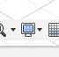

## Setting Object Visibility

### Display Settings Menu

**Step 1:** Go to the 'Display Settings' menu at the bottom of your desktop.

**Step 2:** From the 'Object Visibility' menu make sure Sketches is checked.

### Task 3:

Examine the object provided in class and choose a feature that would require a sketch that is not a simple circle or rectangle. Get your choice approved by the instructor.

**3a:** Create a paper and pencil sketch of the feature with appropriate measurements.  This will guide the sketch you create in Fusion

**3b:** Create a new component and label it Sketch3: Create a sketch in Fusion (on the remaining principle plane of your project.

### Task 4: 

Save your Fusion project to a local file named 'FusionSkills1(First name)(Last name)'. Insert your first and last name with first letters capitalized. Note that this should be a local file in case you need to submit it to your instructor.