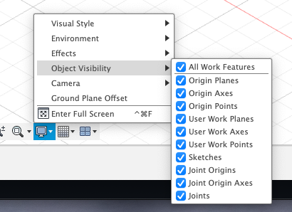

## Setting Object Visibility

### Display Settings Menu

**Step 1:** Go to the 'Display Settings' menu at the bottom of your desktop.

**Step 2:** From the 'Object Visibility' menu make sure Sketches is checked.

If these steps don't make all of your sketches visible talk to your instructor.